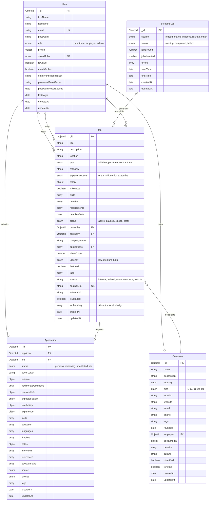
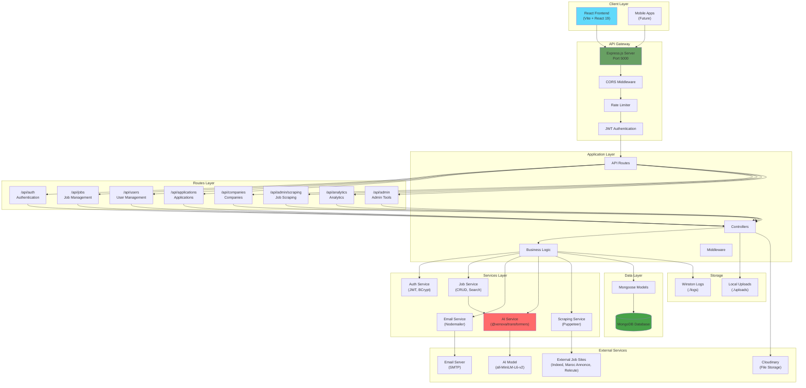
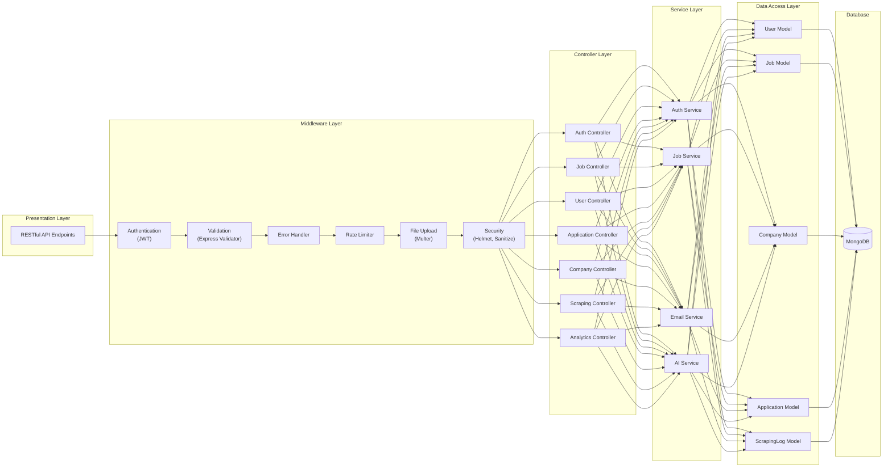
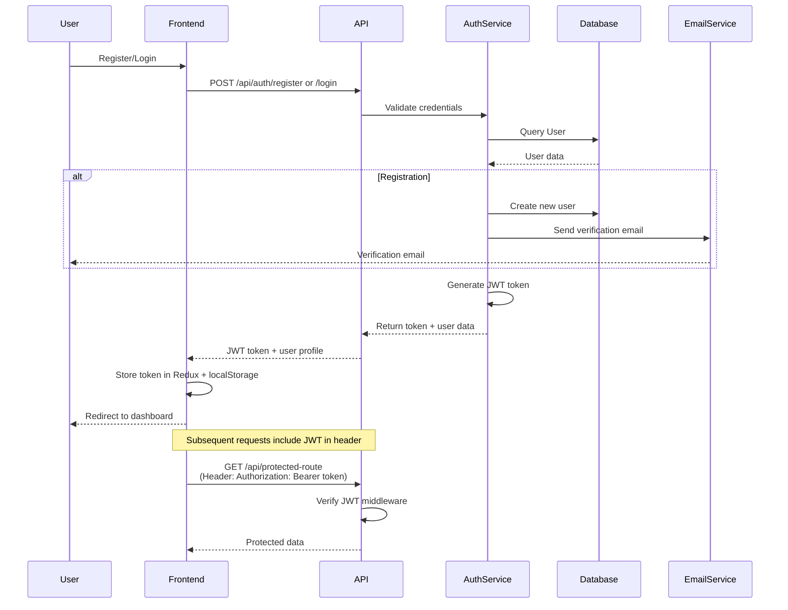
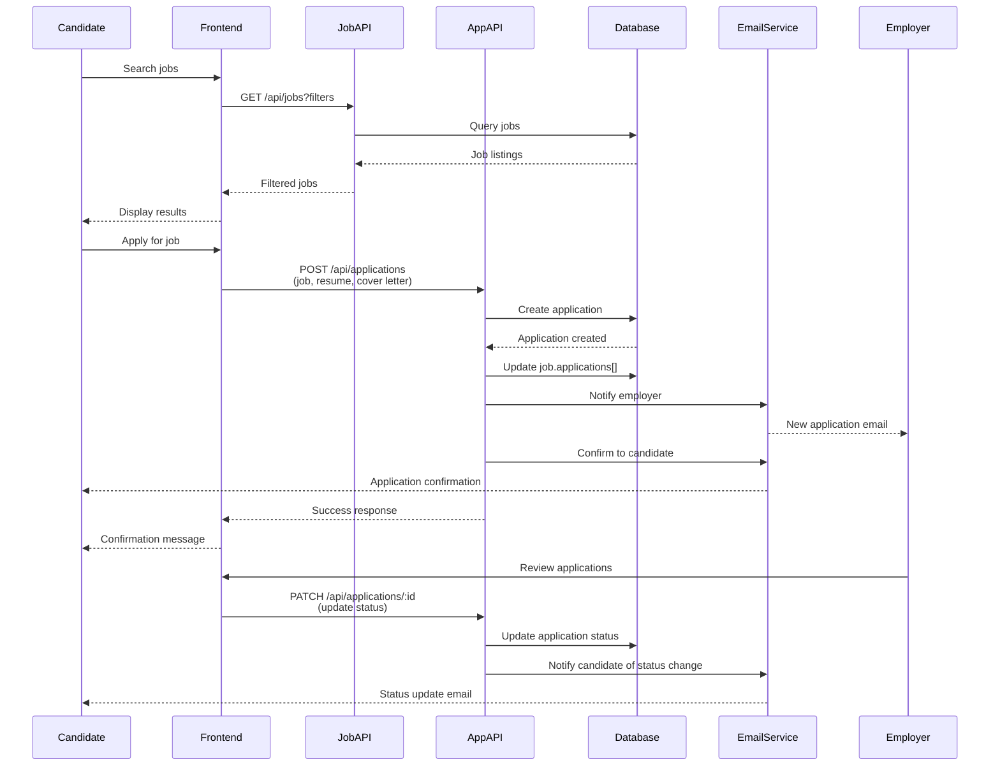
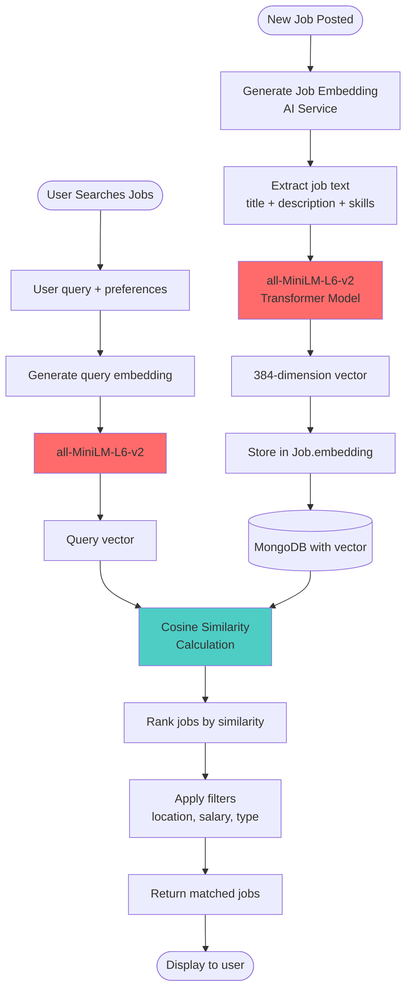
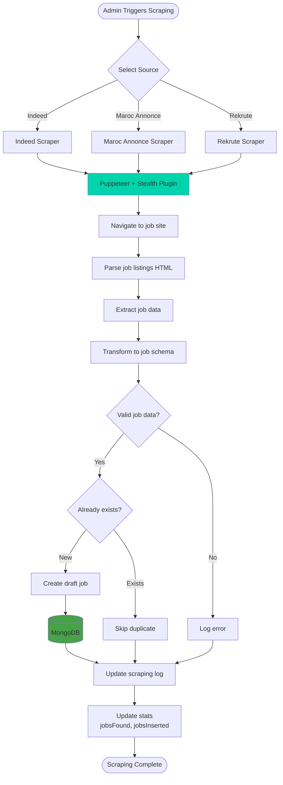
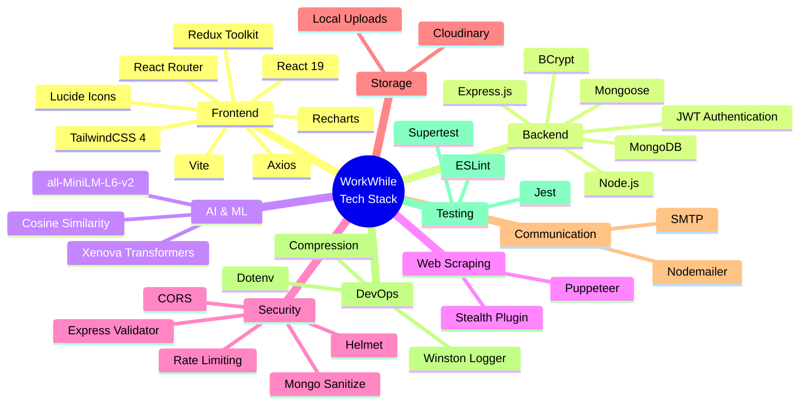

# WorkWhile Application - Architecture Diagrams

## 1. Modèle Conceptuel de Données (MCD) - Entity Relationship Diagram

## 2. System Architecture Diagram

## 3. Backend Architecture - Layered Design

## 4. Authentication Flow

## 5. Job Application Flow

## 6. AI-Powered Job Matching

## 7. Web Scraping Architecture

## 8. Data Security & Middleware Flow

## 9. Technology Stack

## 10. Deployment Architecture

---

## Summary

This documentation provides comprehensive architectural diagrams for the **WorkWhile** job platform application:

1. **MCD (Entity Relationship Diagram)**: Shows the database schema with 5 main entities (User, Job, Company, Application, ScrapingLog) and their relationships
2. **System Architecture**: High-level overview of all system components and their interactions
3. **Backend Layered Architecture**: Shows the separation of concerns in the backend
4. **Authentication Flow**: Sequence diagram for user registration and login
5. **Job Application Flow**: Complete workflow from job search to application status updates
6. **AI-Powered Matching**: How the application uses transformer models for intelligent job matching
7. **Web Scraping**: Architecture for automated job scraping from external sites
8. **Security & Middleware**: Request processing pipeline with all security layers
9. **Technology Stack**: Complete mind map of all technologies used
10. **Deployment Architecture**: Production and development environment setup

### Key Features

- **Full-stack MERN** application (MongoDB, Express, React, Node.js)
- **AI-powered job matching** using transformer models
- **Automated job scraping** from multiple sources
- **Comprehensive authentication** and authorization
- **Multi-role system** (candidates, employers, admins)
- **Real-time application tracking**
- **Scalable microservices-ready** architecture
