# WorkWhile Application - Architecture Diagrams

## 1. Modèle Conceptuel de Données (MCD) - Entity Relationship Diagram

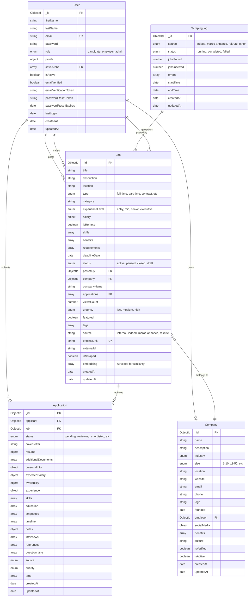

## 2. System Architecture Diagram

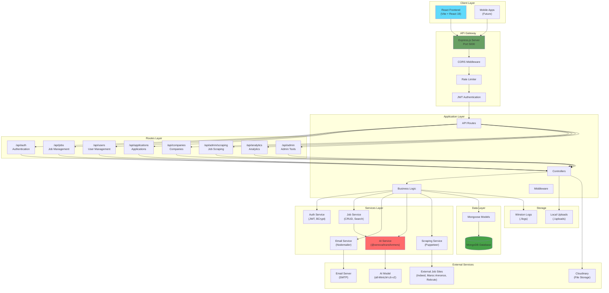

## 3. Backend Architecture - Layered Design

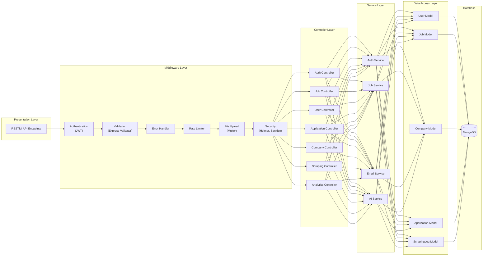

## 4. Authentication Flow

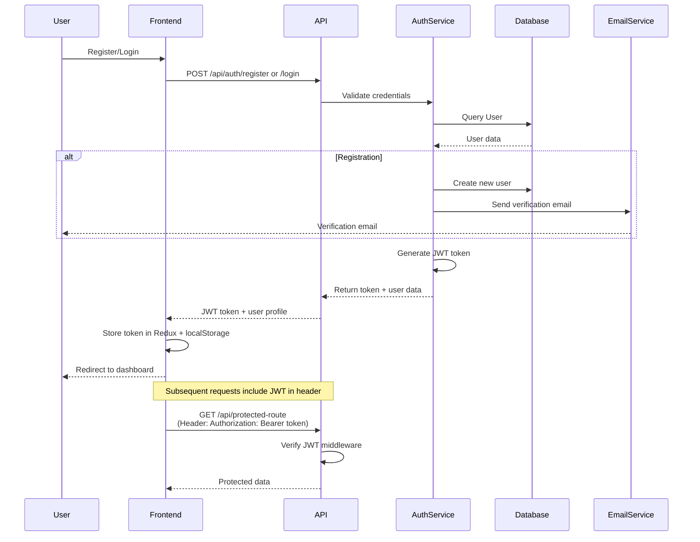

## 5. Job Application Flow

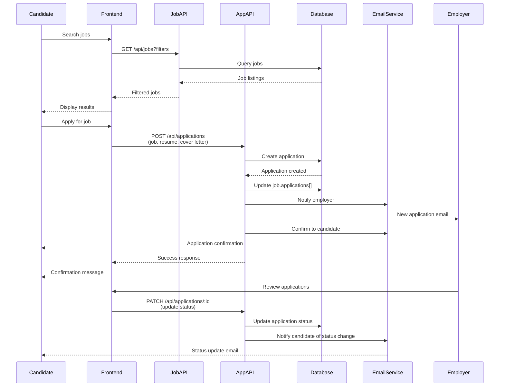

## 6. AI-Powered Job Matching

## 7. Web Scraping Architecture

## 8. Data Security & Middleware Flow

```mermaid
graph LR
    Request([HTTP Request]) --> TrustProxy[Trust Proxy<br/>ngrok, reverse proxies]
    TrustProxy --> CORS[CORS Check<br/>Origin validation]
    CORS --> Options{OPTIONS<br/>request?}
    
    Options -->|Yes| Preflight[Handle preflight<br/>Return CORS headers]
    Options -->|No| RateLimit
    
    Preflight --> End([200 OK])
    
    RateLimit[Rate Limiting<br/>1000 req/15min] --> BodyParse[Body Parser<br/>JSON/URL-encoded]
    BodyParse --> Sanitize[Mongo Sanitize<br/>Prevent NoSQL injection]
    Sanitize --> Compress[Compression<br/>gzip responses]
    Compress --> RequestID[Generate Request ID]
    RequestID --> Logger[Winston Logger]
    Logger --> Route{Route type?}
    
    Route -->|Public| Public[Public endpoints<br/>/health, /ping]
    Route -->|Auth| AuthRoute[Auth routes<br/>/login, /register]
    Route -->|Protected| Protected[Protected routes]
    
    Public --> Response([Send Response])
    
    AuthRoute --> Validate[Express Validator]
    Validate --> AuthController[Auth Controller]
    AuthController --> Response
    
    Protected --> JWT[JWT Verification]
    JWT -->|Invalid| Unauthorized([401 Unauthorized])
    JWT -->|Valid| RoleCheck{Role check<br/>if needed}
    
    RoleCheck -->|Admin only| AdminCheck{Is admin?}
    RoleCheck -->|Any auth user| Controller[Controller]
    
    AdminCheck -->|No| Forbidden([403 Forbidden])
    AdminCheck -->|Yes| Controller
    
    Controller --> Response
    
    Response --> ErrorHandler{Error occurred?}
    ErrorHandler -->|Yes| ErrorMW[Error Handler Middleware]
    ErrorHandler -->|No| Success([Success Response])
    
    ErrorMW --> ErrorLog[Log error to Winston]
    ErrorLog --> ErrorResponse([Error Response])
    
    style JWT fill:#FFD93D
    style Sanitize fill:#6BCF7F
    style CORS fill:#4ECDC4
```

## 9. Technology Stack

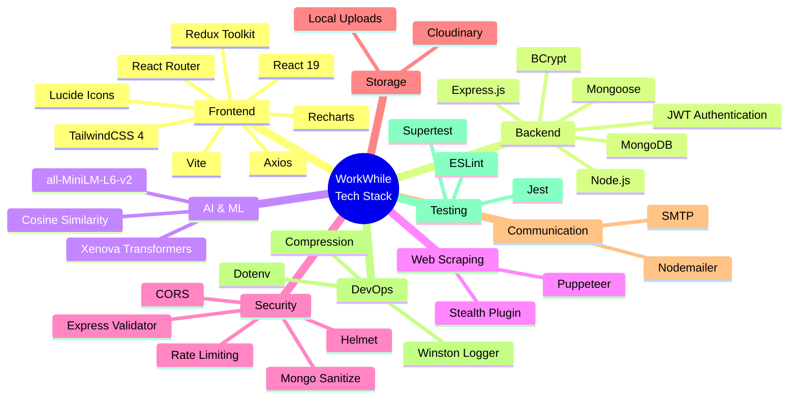

## 10. Deployment Architecture

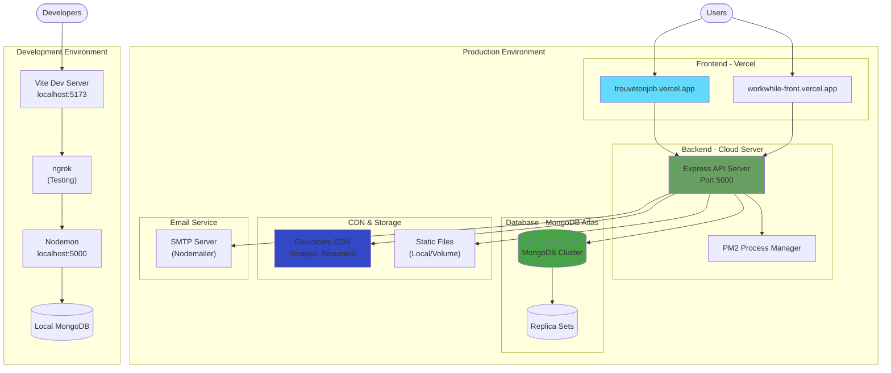

---

## 11. Schéma d'Architecture AWS Cloud

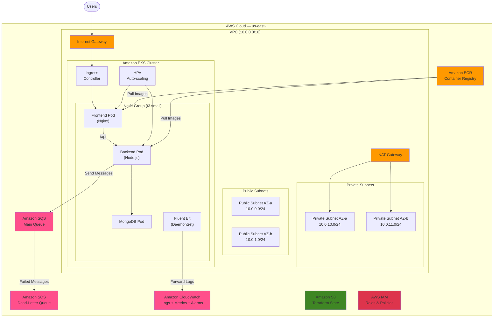

## 12. Schéma du Pipeline CI/CD

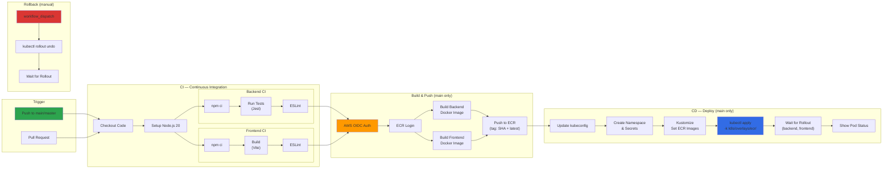

## 13. Schéma Kubernetes (Pods, Services)

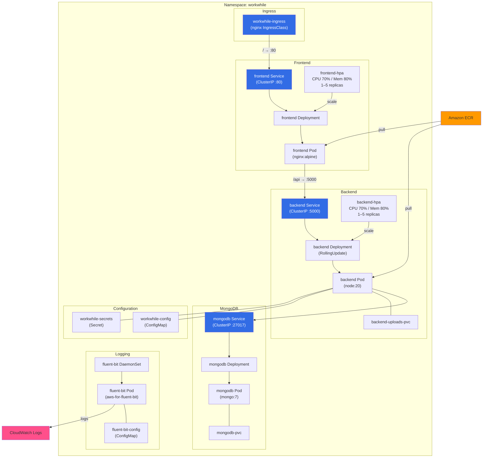

## 14. Schéma Réseau (VPC, Subnets, Sécurité)

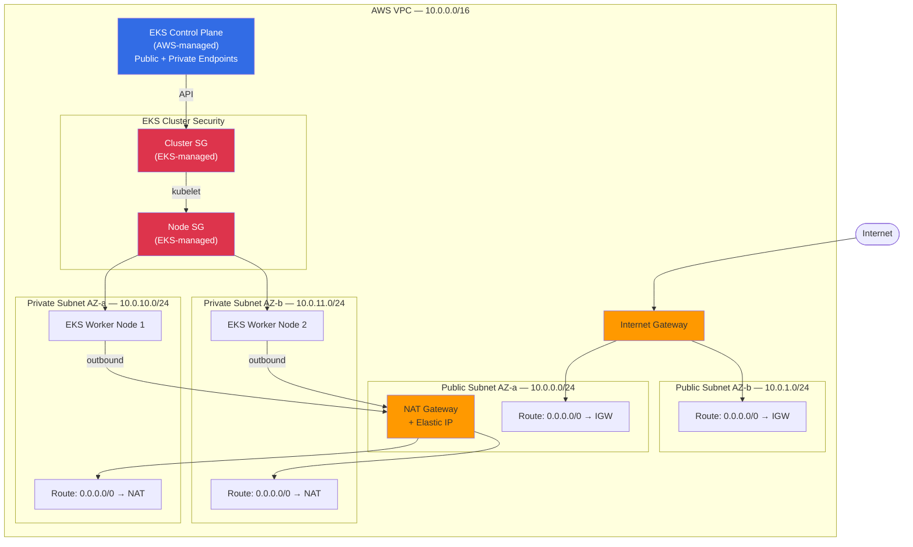

---

## Summary

This documentation provides comprehensive architectural diagrams for the **WorkWhile** platform:

### Application Diagrams (1–10)
1. **MCD (Entity Relationship)** — 5 entities and their relationships
2. **System Architecture** — High-level component overview
3. **Backend Layered Architecture** — Separation of concerns
4. **Authentication Flow** — Registration and login sequence
5. **Job Application Flow** — Search to status update workflow
6. **AI-Powered Matching** — Transformer model integration
7. **Web Scraping** — Automated job scraping architecture
8. **Security & Middleware** — Request processing pipeline
9. **Technology Stack** — Complete tech mind map
10. **Deployment Architecture** — Production and dev environments

### Infrastructure & DevOps Diagrams (11–14)
11. **AWS Cloud Architecture** — VPC, EKS, ECR, SQS, CloudWatch layout
12. **CI/CD Pipeline** — GitHub Actions: CI → Build → Deploy → Rollback
13. **Kubernetes Topology** — Pods, Services, HPAs, DaemonSets, ConfigMaps
14. **VPC Network** — Subnets, routing, NAT Gateway, security groups

